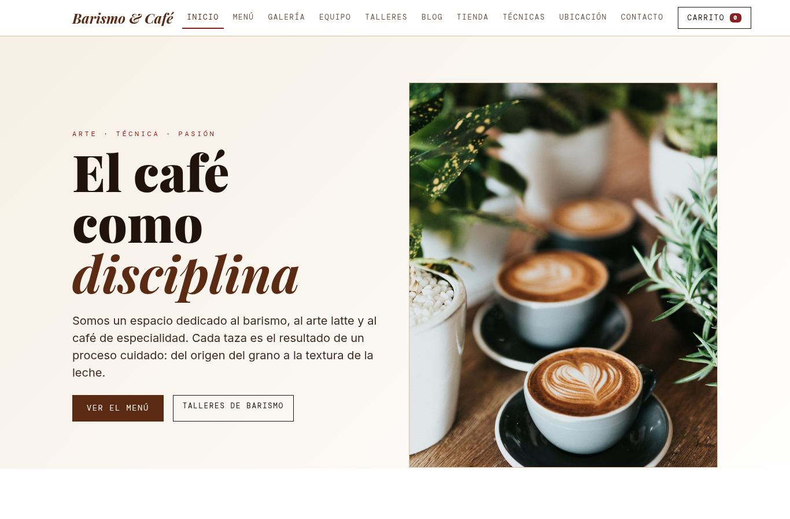
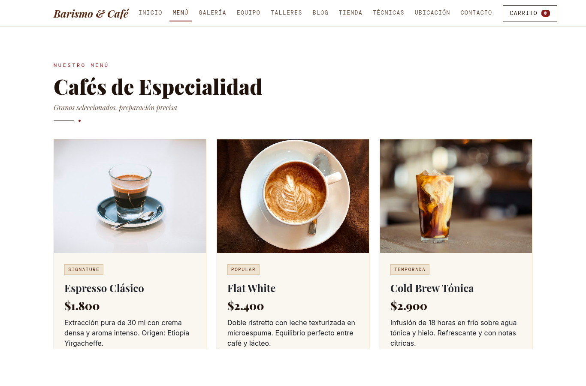
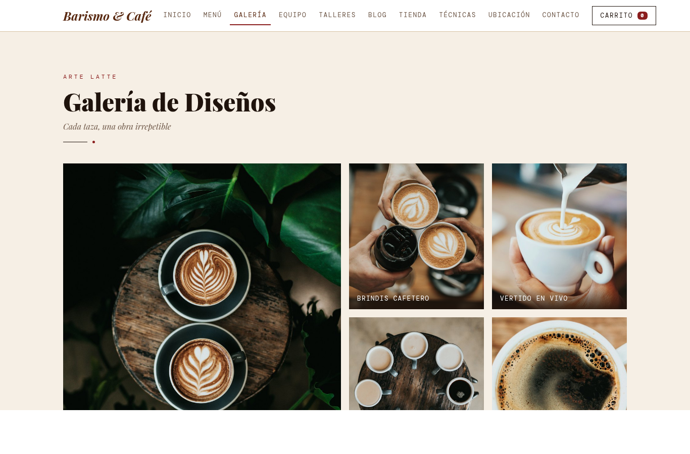
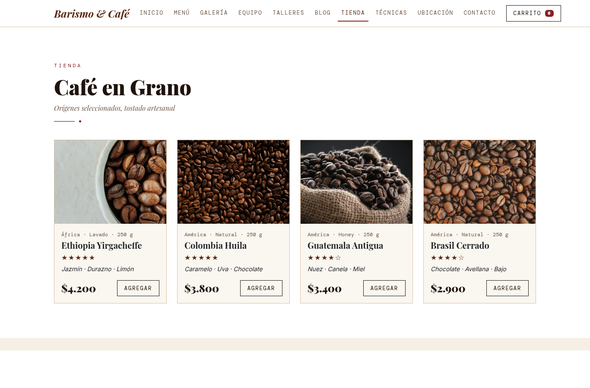
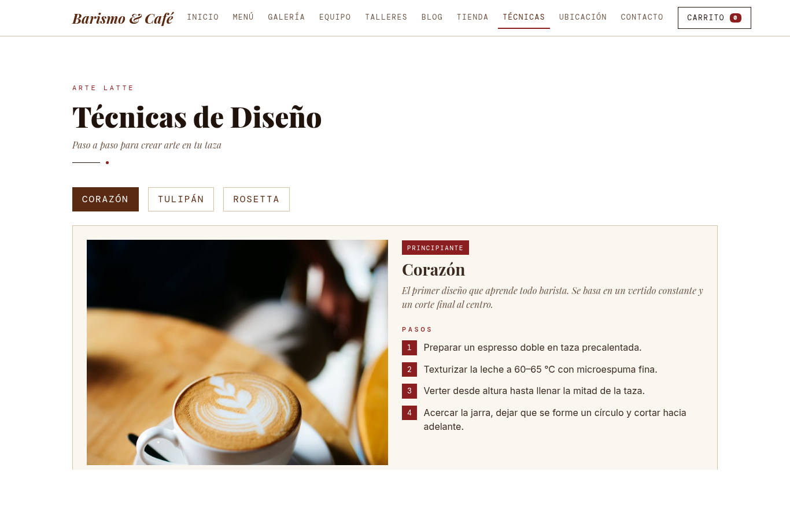
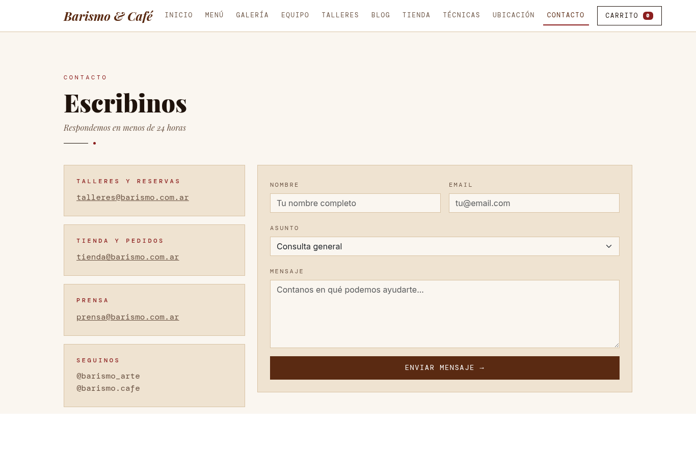

# TP Diseño Web — Café y Arte Latte

Trabajo práctico de Programación Web. Tema elegido: sitio web para mostrar datos del barismo, el arte latte y el café.

> El tema no se puede cambiar en el transcurso del año. Cualquier modificación debe reflejarse en toda la documentación.

## Barismo & Café — Maqueta web (TP N° 3)

Sitio estático de **Barismo & Café**, una cafetería de especialidad dedicada al barismo, al arte
latte y a la formación de baristas. Las 10 vistas se maquetaron en HTML5 + Bootstrap 5 a partir
de los wireframes de Figma.

- **Diseño en Figma:** [Site Map and Wireframe](https://www.figma.com/make/uKNA9mewDLy8gzO9RdJhTZ/Site-Map-and-Wireframe?t=ofV6AHS95d6uyXOT-1&preview-route=%2F%23galer%25C3%ADa)
- **Sitio publicado (GitHub Pages):** https://julieta-andrea-cardozo.github.io/programacion_WEB/
- **Auditoría de Lighthouse y Prettier:** [docs/auditoria-lighthouse.md](docs/auditoria-lighthouse.md)

### Tecnologías

| Tecnología | Uso |
| --- | --- |
| HTML5 semántico | Estructura de las 10 vistas |
| CSS3 (variables, grid, flexbox) | Estilos propios en `css/styles.css` |
| Bootstrap 5.3.3 (CDN) | Grilla responsive, navbar colapsable, pestañas, collapse y formularios |
| JavaScript | Carrito con `localStorage` y validación del formulario (`js/main.js`) |
| Google Fonts | Playfair Display, Inter y DM Mono |
| Prettier 3 | Formateo del código |
| Lighthouse | Auditoría de accesibilidad, rendimiento, buenas prácticas y SEO |
| Git + GitHub + GitHub Pages | Control de versiones y despliegue |

### Vistas

| # | Vista | Archivo | Contenido |
| - | ----- | ------- | --------- |
| 1 | Inicio | `index.html` | Hero, sobre nosotros, accesos destacados y testimonios |
| 2 | Menú | `menu.html` | Cafés de especialidad y tabla de acompañamientos |
| 3 | Galería | `galeria.html` | Galería de diseños de arte latte |
| 4 | Equipo | `equipo.html` | Perfiles de los baristas |
| 5 | Talleres | `talleres.html` | Talleres de barismo con nivel, fecha y precio |
| 6 | Blog | `blog.html` | Notas destacadas desplegables |
| 7 | Tienda | `tienda.html` | Café en grano e insumos para cafetera con carrito |
| 8 | Técnicas | `tecnicas.html` | Pestañas con el paso a paso de corazón, tulipán y rosetta |
| 9 | Ubicación | `ubicacion.html` | Mapa embebido, horarios y datos de contacto |
| 10 | Contacto | `contacto.html` | Formulario con validación y casillas de contacto |

### Estructura del proyecto

```
programacion_WEB/
├── index.html … contacto.html   # 10 vistas
├── css/styles.css               # estilos personalizados
├── js/main.js                   # interacciones
├── img/                         # imágenes y favicon
├── docs/                        # auditoría Lighthouse y capturas
├── .prettierrc / .prettierignore
└── package.json                 # scripts de Prettier
```

### Ejecución local

```bash
git clone https://github.com/Julieta-Andrea-Cardozo/programacion_WEB.git
cd programacion_WEB
npm install            # instala Prettier (opcional)
python3 -m http.server 8080
# abrir http://localhost:8080
```

También se puede abrir `index.html` directamente en el navegador o usar *Live Server* de VS Code.

### Flujo de trabajo con Git

1. `git init` y estructura base `css/`, `js/`, `img/`.
2. Rama de trabajo `feature/maquetacion`.
3. Maquetación de las 10 vistas con Bootstrap y estilos propios.
4. Formateo con Prettier y auditoría de Lighthouse (ver `docs/auditoria-lighthouse.md`).
5. `git push origin feature/maquetacion` y Pull Request hacia `main`.
6. Merge del Pull Request.
7. Despliegue en GitHub Pages.

### Capturas

| Inicio | Menú |
| --- | --- |
|  |  |
| **Galería** | **Tienda** |
|  |  |
| **Técnicas** | **Contacto** |
|  |  |

---

# Documentación de diseño (TP anteriores)

## 1. Intereses personales

Me interesa en particular todo lo relacionado con el café de especialidad: la preparación del espresso, la textura de la leche y el arte latte. También me gusta el diseño gráfico aplicado a lo cotidiano (menús, cartelería, identidad visual de un local) y estoy en contacto permanente con la cultura de internet y las redes sociales.

## 2. Tema elegido

**Tema:** sitio web para mostrar datos del barismo, el arte latte y el café.

Elegí este tema porque combino conocimiento de gastronomía (experiencia como barista) con lo que estoy aprendiendo en la tecnicatura.

## 3. Sitios de referencia

| # | Sitio | Qué es |
|---|-------|--------|
| 1 | [Onyx Coffee Lab](https://onyxcoffeelab.com/) | Tostadora y cadena de cafeterías de EE.UU., e-commerce + storytelling |
| 2 | [Blue Bottle Coffee](https://bluebottlecoffee.com/) | Cadena de cafeterías, e-commerce minimalista |
| 3 | [Perfect Daily Grind](https://perfectdailygrind.com/) | Publicación/blog especializado en café |
| 4 | [Full City Coffee House](https://fullcity.com.ar/) | Tostadora y cafetería de especialidad de Buenos Aires |
| 5 | [La Marzocco Home](https://home.lamarzoccousa.com/) | Marca de máquinas de espresso, foco en producto + educación |

### 1) Onyx Coffee Lab
**Positivos**
- Home muy narrativo: cada bloque combina video corto, imagen y un texto breve sobre el origen del café, así que vende y educa al mismo tiempo.
- Jerarquía de navegación clara (Tienda, Mayoristas, Ubicaciones, Aprender) que separa bien e-commerce de contenido educativo.
- Sección de premios y reconocimientos que construye autoridad de marca de un vistazo.

**Negativos**
- La home es larguísima, con muchos videos autoplay: carga pesada y hay que scrollear mucho para llegar al pie.
- Exceso de banners promocionales (colaboraciones, merchandising) que compiten entre sí por la atención.
- Al ser un sitio de e-commerce grande, no es un ejemplo simple de replicar para un TP académico.

### 2) Blue Bottle Coffee
**Positivos**
- Enfoque "menos es más": la home muestra un producto destacado, imagen simple y un botón de compra, sin ruido visual.
- Menú de navegación breve y directo a las secciones clave (Tienda, Suscripciones, Ubicaciones).
- Fuerte coherencia de marca (tipografía, paleta de color) en todas las páginas.

**Negativos**
- Analistas de UX señalan que la página de ubicaciones no promociona su propia app, una oportunidad desaprovechada.
- El menú de cafetería no siempre está visible desde el home, lo que dificulta a quien solo quiere ver qué se puede tomar en el local.
- El agrupamiento de productos en la tienda puede resultar confuso por la cantidad de variantes.

### 3) Perfect Daily Grind
**Positivos**
- Estructura de blog/revista muy ordenada: categorías claras (barista, tueste, producción, cafeterías).
- Cada artículo tiene "key takeaways" al inicio, ideal para quien busca información rápida sobre técnica.
- Newsletter y suscripción bien integradas sin ser invasivas.

**Negativos**
- Al ser un sitio con miles de artículos, la búsqueda y el filtrado pueden quedar cortos para encontrar contenido específico.
- Diseño visual más funcional que atractivo, con poco uso de imágenes propias grandes.
- Mucho texto por página, lo que puede resultar denso para un lector que solo quiere una guía rápida.

### 4) Full City Coffee House
**Positivos**
- Sitio simple y liviano, fácil de tomar como referencia de estructura para un TP (Tienda, Mayoristas, Trainers, Quiénes somos).
- Buena combinación de e-commerce (venta de café) y presentación del local físico con mapa embebido.
- Identidad visual coherente con el local real, útil como ejemplo "de escala real" y no una multinacional.

**Negativos**
- Pocas imágenes de arte latte o del proceso de barismo, algo débil para un sitio que se supone gira en torno al café de especialidad.
- Estructura de menú algo escueta; le faltan secciones de contenido educativo o blog.
- El footer repite enlaces que ya están en el header, es redundante.

### 5) La Marzocco Home
**Positivos**
- Buen equilibrio entre catálogo de producto (máquinas) y contenido educativo/institucional (Accademia del Caffè Espresso).
- Diseño elegante, con fotografía de producto de alta calidad, coherente con el posicionamiento premium de la marca.
- Blog de novedades bien integrado, con fechas y actualizaciones frecuentes visibles en la home.

**Negativos**
- Enfocado en la venta de equipamiento, no en el barismo o el arte latte en sí, así que como referencia de contenido es más limitado.
- El aviso de cookies y las capas de personalización pueden interrumpir la primera visita.
- Al tener versiones por país (home vs. profesional, distintos dominios), la navegación puede confundir a un usuario nuevo.

## 4. Wireframes a mano — secciones (mínimo 10)

1. Header / navegación principal
2. Hero o banner principal (imagen de un latte art destacado)
3. Sobre nosotros / nuestra historia como cafetería o barista
4. Menú de cafés (espresso, con leche, bebidas frías)
5. Galería de arte latte (diseños destacados)
6. Perfil de baristas / equipo
7. Clases o talleres de barismo
8. Blog o novedades sobre café
9. Testimonios o reseñas de clientes
10. Ubicación y horarios (mapa embebido)
11. Tienda online (granos, equipos)
12. Contacto / formulario / newsletter
13. Footer con redes sociales y enlaces legales


julieta cardozo — Tecnicatura Superior en Análisis de Sistemas, IES N° 6.001 (Salta, Argentina)
