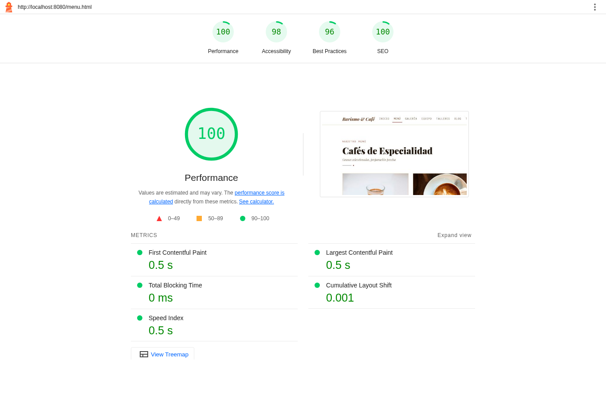
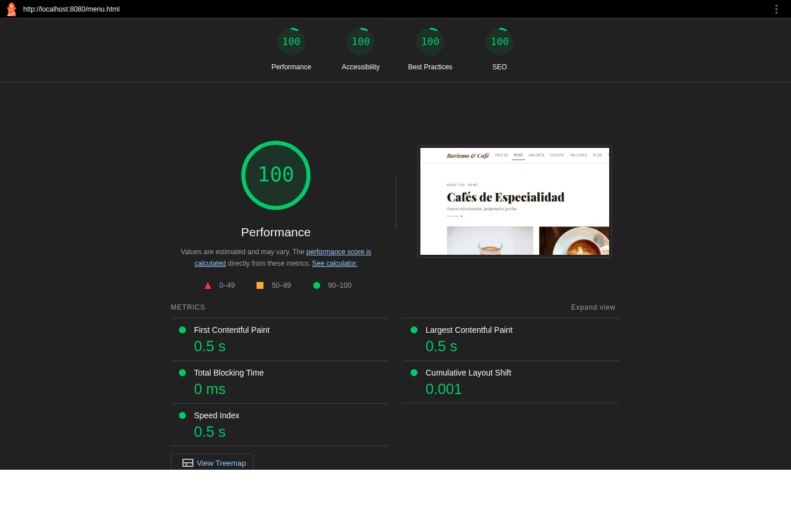
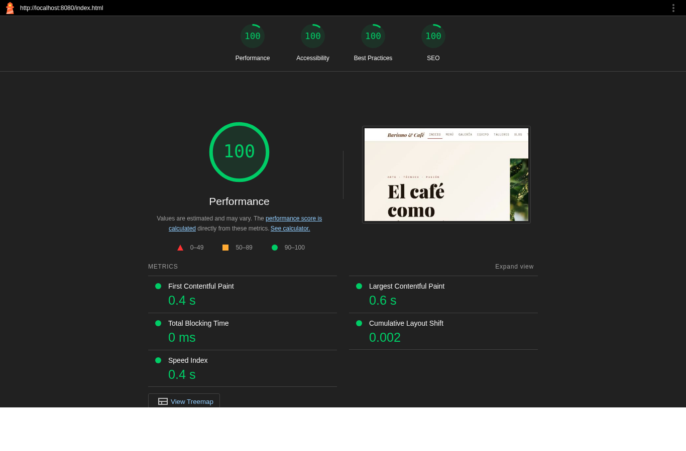

# Auditoría de Lighthouse y formateo con Prettier — Barismo & Café

Documento del **Paso 4 del TP N° 3**: formateo del código con Prettier y auditoría de
accesibilidad con Lighthouse (Chrome DevTools), con las fallas detectadas y su corrección.

## 1. Formateo con Prettier

- Versión: `prettier@3.3.3` (instalado como dependencia de desarrollo en `package.json`).
- Configuración: `.prettierrc` (ancho 100, 2 espacios, comillas dobles) y `.prettierignore`
  (excluye `img/`, PDF, DOCX y `node_modules/`).
- Comandos:

```bash
npm install
npm run format        # formatea HTML, CSS, JS y MD
npm run format:check  # verifica que todo esté formateado
```

Resultado de `npm run format:check`:

```
Checking formatting...
All matched files use Prettier code style!
```

## 2. Metodología de la auditoría

- Herramienta: Lighthouse 12.2.1 (el mismo motor que la pestaña _Lighthouse_ de Chrome DevTools).
- Navegador: Google Chrome (modo headless).
- Servidor local: `python3 -m http.server 8080` sobre la raíz del proyecto.
- Categorías: Performance, Accessibility, Best Practices y SEO.
- Se auditaron las **10 vistas** en modo **escritorio** y en modo **móvil**.

## 3. Primera auditoría (antes de corregir) — escritorio

| Vista            | Performance | Accesibilidad | Buenas prácticas | SEO | Falla de accesibilidad |
| ---------------- | :---------: | :-----------: | :--------------: | :-: | ---------------------- |
| `index.html`     |     100     |      100      |        96        | 100 | —                      |
| `menu.html`      |     100     |      98       |        96        | 100 | `heading-order`        |
| `galeria.html`   |     100     |      100      |        96        | 100 | —                      |
| `equipo.html`    |     100     |      98       |        96        | 100 | `heading-order`        |
| `talleres.html`  |     100     |      98       |        96        | 100 | `heading-order`        |
| `blog.html`      |     100     |      98       |        96        | 100 | `heading-order`        |
| `tienda.html`    |     100     |      98       |        96        | 100 | `heading-order`        |
| `tecnicas.html`  |     100     |      100      |        96        | 100 | —                      |
| `ubicacion.html` |     100     |      100      |        96        | 100 | —                      |
| `contacto.html`  |     100     |      100      |        96        | 100 | —                      |



### Fallas detectadas

| #   | Auditoría de Lighthouse                | Descripción                                                                                                                                                                                                                                                           | Vistas afectadas                     |
| --- | -------------------------------------- | --------------------------------------------------------------------------------------------------------------------------------------------------------------------------------------------------------------------------------------------------------------------- | ------------------------------------ |
| 1   | `heading-order` (Accesibilidad)        | _"Heading elements are not in a sequentially-descending order"_: las tarjetas usaban `<h3>` directamente después del `<h1>`, saltando el nivel `<h2>`. Los lectores de pantalla usan los encabezados para navegar, por lo que saltear niveles confunde la estructura. | menú, equipo, talleres, blog, tienda |
| 2   | `errors-in-console` (Buenas prácticas) | El navegador pedía `/favicon.ico` y obtenía un error 404 en la consola.                                                                                                                                                                                               | las 10 vistas                        |

## 4. Correcciones aplicadas

Commit: `fix(a11y): corregir orden de encabezados y agregar favicon según Lighthouse`.

1. **Orden de encabezados:** los títulos de tarjetas (bebidas, baristas, talleres, notas del blog y
   cafés en grano) pasaron de `<h3>` a `<h2>`. Se mantuvo el tamaño visual con las clases de
   Bootstrap `h4`/`h5`, así que el diseño no cambia.

   ```html
   <!-- Antes -->
   <h3 class="card-title h4">Espresso Clásico</h3>
   <!-- Después -->
   <h2 class="card-title h4">Espresso Clásico</h2>
   ```

2. **Favicon:** se agregó `img/favicon.svg` y se enlazó en el `<head>` de todas las vistas:

   ```html
   <link rel="icon" href="img/favicon.svg" type="image/svg+xml" />
   ```

### Buenas prácticas de accesibilidad incluidas desde la maquetación

- `lang="es"` en el documento y `<meta name="viewport">` en todas las vistas.
- Enlace **"Saltar al contenido"** (`.skip-link`) visible al recibir foco con el teclado.
- Estructura semántica: `header`, `nav` con `aria-label`, `main#contenido`, `section` con
  `aria-labelledby`, `article`, `figure`/`figcaption`, `address`, `time`, `dl`.
- Enlace activo marcado con `aria-current="page"`.
- Todas las imágenes tienen `alt` descriptivo y `width`/`height` (evita saltos de diseño).
- Formularios con `<label for>` asociado, `autocomplete` y mensajes de validación.
- Pestañas de Técnicas con roles ARIA (`tablist`, `tab`, `tabpanel`) de Bootstrap.
- Botones de "Agregar" y "Leer nota" con `aria-label`/`aria-controls` descriptivos.
- Mensaje del carrito con `role="status"` y `aria-live="polite"`.
- Indicador de foco visible (`:focus-visible`) y paleta con contraste AA
  (texto `#3b2a20` sobre crema `#f6efe5`).
- `iframe` del mapa con `title` descriptivo.

## 5. Auditoría final (después de corregir)

### Escritorio

| Vista            | Performance | Accesibilidad | Buenas prácticas | SEO |
| ---------------- | :---------: | :-----------: | :--------------: | :-: |
| `index.html`     |     100     |    **100**    |       100        | 100 |
| `menu.html`      |     100     |    **100**    |       100        | 100 |
| `galeria.html`   |     100     |    **100**    |       100        | 100 |
| `equipo.html`    |     100     |    **100**    |       100        | 100 |
| `talleres.html`  |     100     |    **100**    |       100        | 100 |
| `blog.html`      |     100     |    **100**    |       100        | 100 |
| `tienda.html`    |     99      |    **100**    |       100        | 100 |
| `tecnicas.html`  |     100     |    **100**    |       100        | 100 |
| `ubicacion.html` |     100     |    **100**    |       100        | 100 |
| `contacto.html`  |     100     |    **100**    |       100        | 100 |





### Móvil

| Vista            | Performance | Accesibilidad | Buenas prácticas | SEO |
| ---------------- | :---------: | :-----------: | :--------------: | :-: |
| `index.html`     |     94      |    **100**    |       100        | 100 |
| `menu.html`      |     96      |    **100**    |       100        | 100 |
| `galeria.html`   |     87      |    **100**    |       100        | 100 |
| `equipo.html`    |     96      |    **100**    |       100        | 100 |
| `talleres.html`  |     98      |    **100**    |       100        | 100 |
| `blog.html`      |     97      |    **100**    |       100        | 100 |
| `tienda.html`    |     94      |    **100**    |       100        | 100 |
| `tecnicas.html`  |     98      |    **100**    |       100        | 100 |
| `ubicacion.html` |     98      |    **100**    |       100        | 100 |
| `contacto.html`  |     98      |    **100**    |       100        | 100 |

El puntaje de Performance en móvil de la galería (87) se debe al tamaño de las fotografías en
una red móvil simulada; no afecta la accesibilidad.

## 6. Reportes completos

Los reportes HTML originales de Lighthouse de la vista `menu.html` (antes y después) están en
[`docs/lighthouse/`](lighthouse/) y se pueden abrir con cualquier navegador.

## 7. Cómo repetir la auditoría

1. Levantar un servidor local en la carpeta del proyecto (`python3 -m http.server 8080` o
   _Live Server_ de VS Code).
2. Abrir `http://localhost:8080/index.html` en Chrome.
3. `F12` → pestaña **Lighthouse** → marcar _Accessibility_ (y las demás categorías) → **Analyze page load**.
4. Repetir en cada una de las 10 vistas.
